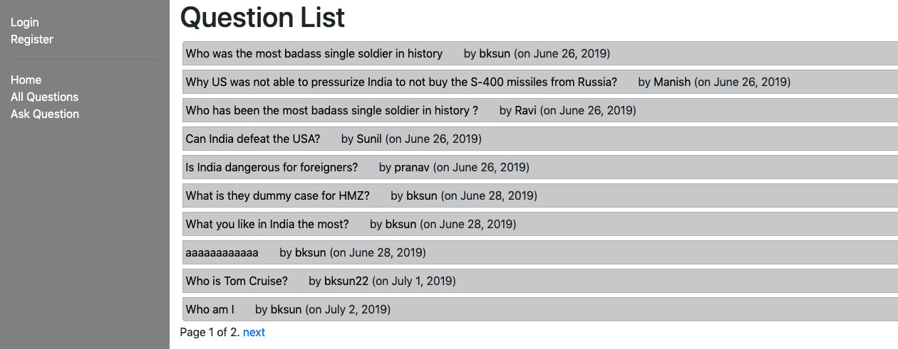
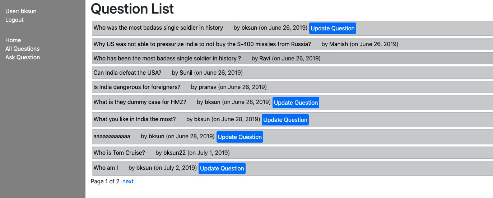
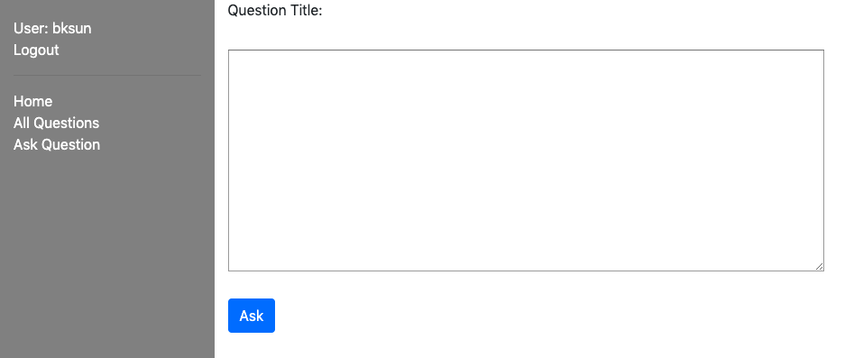
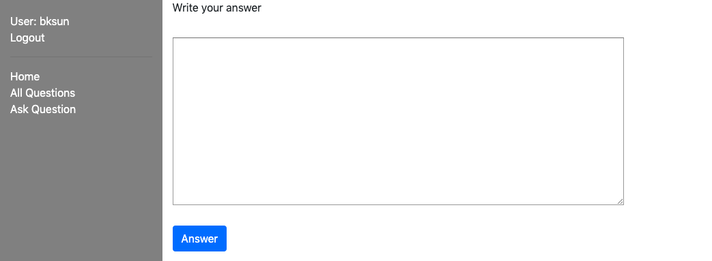
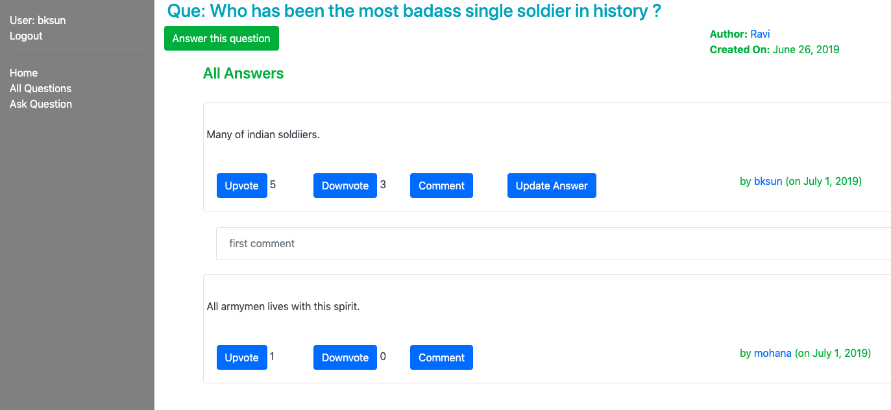

# my-quora-app
A Quora like basic web-app using DJango 2.2

## Features
* User can **ask question**
* User can **answer question**
* User can **comment on answers**
* User can **upvote and downvote**
* User can **signup, login & logout**

## Screen shots
<details><summary><b>Question lists</b></summary>
  <p align="center">
    
  </p>

  <p align="center">
    
  </p>
</details>

<details><summary><b>Login</b></summary>
  <p align="center">
    
  </p>
</details>

<details><summary><b>Ask Question</b></summary>
  <p align="center">
    
  </p>
</details>

<details><summary><b>Answer Question</b></summary>
  <p align="center">
    
  </p>
</details>

<details><summary><b>Question details</b></summary>
  <p align="center">
    
  </p>
</details>


## Setup

Clone the project

```bash
git clone https://github.com/bksun/my-quora-app.git
```

create and start a a virtual environment

```bash
virtualenv env --no-site-packages

source env/bin/activate
```

Install the python package requirements using `pip`.

```bash
pip install -r requirements.txt
```

Run the migrate command to create database tables.

```bash
python manage.py migrate
```

Use the `createsuperuser` command to create a user who has superuser privileges.

```bash
python manage.py createsuperuser
```

Finally run the server using the `runserver` command.

```bash
python manage.py runserver
```

## Testing

Linter test using Flake8

```bash
flake8 .
```

Unit tests and Coverage report.

```bash
pytest
```

## Built with

* [DJango 2.2.2](https://www.djangoproject.com/)
* [Bootstrap-4](https://getbootstrap.com/docs/4.0/getting-started/introduction/)
* Flate-8
* [Pytest](https://docs.pytest.org/en/latest/contents.html)

## Contribute

1. Feel free to raise issue
2. Highly appreciate for pull request

## License

[MIT](https://choosealicense.com/licenses/mit/)
